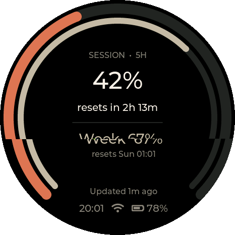
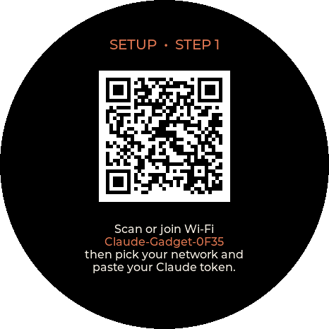
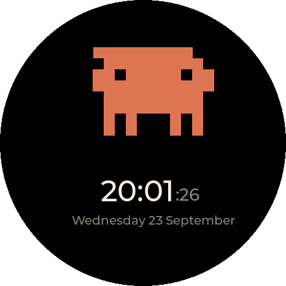
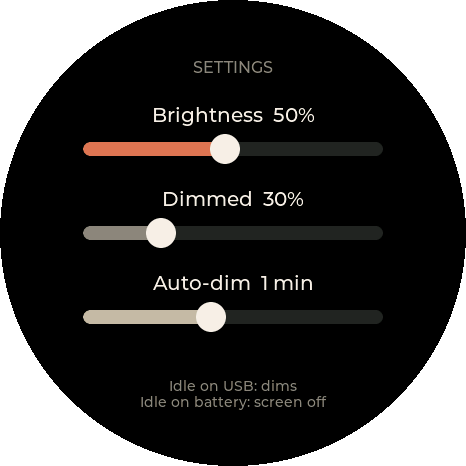
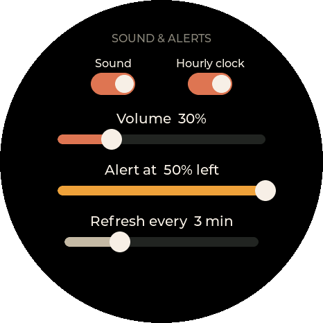
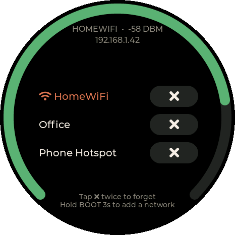
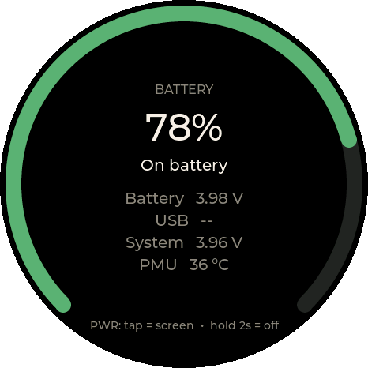
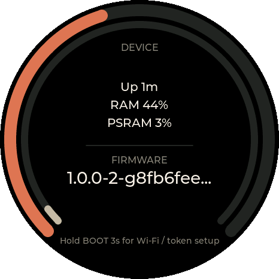

# Claude Gadget

A small round display that shows your **Claude Pro/Max plan usage**: the 5-hour session and weekly limits, how long until each resets, and an alert when you're running low. It connects over Wi-Fi on its own, so no computer or phone app needs to stay running.

Built for the [Waveshare ESP32-S3-Touch-AMOLED-1.75C](https://docs.waveshare.com/ESP32-S3-Touch-AMOLED-1.75C).

**[Install from your browser →](https://markab.github.io/claude-gadget/)**

<p align="center"></p>

> Unofficial fan project, not affiliated with or endorsed by Anthropic.

## Contents

- [What you need](#what-you-need)
- [Install](#install)
- [First-time setup](#first-time-setup)
- [Using it](#using-it)
- [Screens and settings](#screens-and-settings)
- [Updates](#updates)
- [Power and battery](#power-and-battery)
- [Wi-Fi](#wi-fi)
- [Troubleshooting](#troubleshooting)
- [How usage is read](#how-usage-is-read)
- [Building from source](#building-from-source)

## What you need

- A Waveshare **ESP32-S3-Touch-AMOLED-1.75C**. A 3.7 V LiPo battery on the MX1.25 connector is optional.
- A USB-C **data** cable. Charge-only cables won't work for installing.
- A Claude **Pro or Max** subscription and [Claude Code](https://docs.anthropic.com/en/docs/claude-code) on any computer, to create a token.
- 2.4 GHz Wi-Fi. The ESP32-S3 doesn't support 5 GHz.

## Install

1. Open the **[web installer](https://markab.github.io/claude-gadget/)** in desktop Chrome or Edge.
2. Plug in the board and click **Install firmware**. Pick the port, usually "USB JTAG/serial debug unit".
3. On a first install, choose **Erase**. When updating, don't erase, and your Wi-Fi, token and settings are kept.

If no port appears, hold **BOOT**, tap **PWR** (or unplug and replug), then release BOOT and try again.

Each [release](https://github.com/markab/claude-gadget/releases) also includes the firmware files, for flashing with `esptool`:

```bash
esptool --chip esp32s3 write-flash 0x0 claude-gadget-<version>-factory.bin
```

The factory image erases all settings. To update without losing them, flash the app image at `0x10000` instead.

## First-time setup



1. **Create a token.** On a computer with Claude Code, run:
   ```bash
   claude setup-token
   ```
   Log in when the browser opens. It prints a long-lived token starting `sk-ant-oat01-`. Keep it private.
2. **Join the gadget's hotspot.** The screen shows a QR code. Scan it, or join the **Claude-Gadget-XXXX** Wi-Fi network. The setup page opens by itself; if not, browse to `192.168.4.1`.
3. **Enter your details.** Pick your Wi-Fi network and enter its password. Paste the token and check the timezone. The timezone is a POSIX TZ string; the default is UK time, `GMT0BST,M3.5.0/1,M10.5.0`.
4. **Save.** The gadget joins your Wi-Fi and shows usage a few seconds later.

If the gadget is on Wi-Fi but has no token, it shows a QR code for its settings page on your network (`http://<device-ip>/param`) instead.

<br clear="right">

## Using it

| Control | Action |
|---|---|
| **PWR** tap | Turn the screen on or off |
| **PWR** hold 2 s | Power off. Press PWR to power back on. |
| **BOOT** tap | Refresh usage now |
| **BOOT** hold 3 s | Open the setup hotspot to add a Wi-Fi network or change the token or timezone. It closes after 5 idle minutes. |
| Tap the screen | Wake the screen when it's off |
| Swipe left / right | Move between pages |

The gadget starts on **Usage**. Swipe right from there for the **Clock**, and left for the other pages:

**Clock** ← **Usage** → **Settings** → **Sound & alerts** → **Wi-Fi** → **Battery** → **Device**

If the gadget ever hangs, holding PWR for 6 s forces it off.

## Screens and settings

### Usage


- **Outer ring and big number:** the 5-hour session, with a countdown to when it resets.
- **Inner ring and "Week":** the weekly limit, with the day and time it resets.
- The rings turn amber at 75% used and red at 90%.
- **Bottom lines:** when usage last updated (or what's wrong, e.g. "Token rejected"), then the time, Wi-Fi and battery.

<br clear="right">

### Clock



The time with seconds, and the date.

<br clear="right">

### Settings



| Setting | What it does |
|---|---|
| **Brightness** | Normal screen brightness, 5–100% in 5% steps |
| **Dimmed** | Brightness when idle on USB power, 5–100%. The screen previews it while you drag. |
| **Auto-dim** | How long idle before the screen dims (on USB) or turns off (on battery): 15 s to 30 min, or Never |

<br clear="right">

### Sound & alerts



| Setting | What it does |
|---|---|
| **Sound** | Turns all sounds on or off: the startup and power-off chimes, the hourly chime and quota alerts |
| **Hourly clock** | On the hour (screen on only), shows the time for 10 s with a chime. Tap to dismiss. |
| **Volume** | 5–100% in 5% steps. It plays a short beep when you let go. |
| **Alert at X% left** | Beeps and shows a warning when the session or weekly quota left drops to this level. Off, or 5–50%. It alerts once per window and again after that window resets. |
| **Refresh every** | How often usage is checked: 1, 2, 3, 5, 10, 15, 30 or 60 minutes. The default is 5. |

<br clear="right">

### Wi-Fi



- **Top:** the current network, its signal strength and the gadget's IP address.
- **Ring:** signal strength. The current network is highlighted in orange in the list.
- **To forget a network:** tap its **✕**, then tap again within 3 s to confirm. If you forget the network you're connected to, the gadget disconnects and looks for another saved one.

<br clear="right">

### Battery



- Charge level and charging state.
- Battery, USB and system voltages.
- Power-chip temperature.

<br clear="right">

### Device



- **Outer ring:** internal memory in use.
- **Inner ring:** PSRAM in use.
- Also uptime and memory use.
- **Firmware:** the installed version, with "Up to date" once the gadget has checked for a newer release. When one is available, this becomes an **Update to x.y.z** pill. See [Updates](#updates).

<br clear="right">

## Updates

The gadget checks for a new release at startup and then every 6 hours, while it's on Wi-Fi.

- When a newer version is available, the firmware line on the **Device** page becomes an orange **Update to x.y.z** pill.
- Tap the pill to download and install the update over Wi-Fi. A progress ring shows the download. When it's finished, the gadget restarts on the new version.
- Your Wi-Fi networks, token and settings are kept.
- To update, the gadget must be plugged into USB or have at least 30% battery.
- Don't power it off while updating. If an update fails (e.g. Wi-Fi drops), the gadget keeps running the current version and you can try again.

You can also update from the [web installer](https://markab.github.io/claude-gadget/) over USB without erasing.

## Power and battery

- **On battery:** the screen turns off after the auto-dim time. With the screen off, Wi-Fi switches off and the chip sleeps. When you wake it, the last numbers show immediately and fresh ones follow within a few seconds.
- **On USB:** the screen dims instead of turning off. If you turn the screen off with PWR, it stays connected and keeps refreshing.
- **Low battery:** the gadget warns you, then powers itself off after 30 s below 3.3 V.
- Plugging in or unplugging USB wakes the screen.

## Wi-Fi

- The gadget remembers the last **5** networks it joined. When it starts, or loses its connection (e.g. you've moved somewhere else), it joins the strongest saved network in range.
- If no saved network is in range for 90 s, it opens the setup hotspot so you can add one.
- To add a network while connected, hold **BOOT** for 3 s.
- Your token is stored separately from the Wi-Fi details. Leave the token field blank on the setup page to keep it.
- **iPhone hotspot:** turn on **Maximize Compatibility** in Personal Hotspot settings, so it uses 2.4 GHz.

## Troubleshooting

| Problem | Fix |
|---|---|
| **Token rejected** | The token was revoked or has expired (they last a year). Run `claude setup-token` again, hold BOOT 3 s and paste the new token. |
| **Stuck on "Connecting to Wi-Fi"** | Check the network is 2.4 GHz and in range. Hold BOOT 3 s to re-enter the password or pick another network. |
| **Can't join the setup hotspot** | Forget the Claude-Gadget network on your phone and join again. |
| **Numbers look stale** | Tap BOOT to refresh now. Check the refresh interval on Sound & alerts. |
| **No sound** | Check Sound is on and the volume is above 5% on Sound & alerts. |
| **Computer doesn't see the board** | Use a data cable. Hold BOOT, tap PWR, release BOOT, then retry. |

## How usage is read

There's no official public API for Pro/Max plan usage. Every Claude API response includes rate-limit headers (`anthropic-ratelimit-unified-5h-*` and `-7d-*`) with your current utilisation. So on each refresh the gadget sends the smallest possible request (Haiku, one output token) and reads those headers. The approach comes from [Clawdmeter](https://github.com/HermannBjorgvin/Clawdmeter).

- Each refresh uses a tiny amount of your plan's quota.
- This is unofficial and could stop working if Anthropic changes those headers.
- The token is stored unencrypted in the device's flash. Anyone with the device and a USB cable could read it, so revoke the token if the gadget is lost.
- Connections to the API are TLS-verified against embedded root certificates ([src/certs.h](src/certs.h)).

## Building from source

Needs [PlatformIO](https://platformio.org/).

```bash
pio run -t upload        # build and flash over USB
pio device monitor       # serial log
```

Serial commands (in the monitor):

| Key | Action |
|---|---|
| `h` | Show the hourly clock and play its chime |
| `a` | Play the quota alert |
| `t` | Print the timezone and local time |
| `s` | Stream screenshots (used by `tools/screenshots.py`) |

To refresh the README screenshots, which use demo data rather than your own:

```bash
~/.platformio/penv/bin/python tools/screenshots.py
```

### Releases

Push a version tag to build and publish a release:

```bash
git tag v1.0.0
git push origin v1.0.0
```

The [Release workflow](.github/workflows/release.yml) builds the firmware with that version and attaches the factory and app images to a GitHub Release. It also deploys the web installer (`docs/` plus the firmware) to GitHub Pages. Gadgets pick up the new version from the Pages site's `manifest.json` and download `firmware/firmware.bin` from there, so OTA updates start as soon as the deploy finishes. You can also run it from the Actions tab to redeploy the site.

### Code layout

| File | Purpose |
|---|---|
| `src/main.cpp` | Startup, main loop, buttons, idle and low-battery handling, alerts |
| `src/claude.cpp` | Background usage polling and header parsing |
| `src/net.cpp` | Setup portal, saved networks and roaming, NTP |
| `src/power.cpp` | AXP2101 power chip: PWR button, charging, voltages, shutdown |
| `src/display.cpp` | CO5300 AMOLED, CST9217 touch, LVGL setup |
| `src/sound.cpp` | ES8311 codec and tone synthesis |
| `src/ota.cpp` | Update check and over-the-air install |
| `src/ui.cpp` | All screens |
| `src/settings.cpp` | Settings stored in flash |
| `src/portal_theme.h` | Setup portal styling |
| `docs/` | Web installer page and screenshots |

`src/es8311/` is Espressif's ES8311 driver (Apache-2.0), taken from Waveshare's examples for this board.
